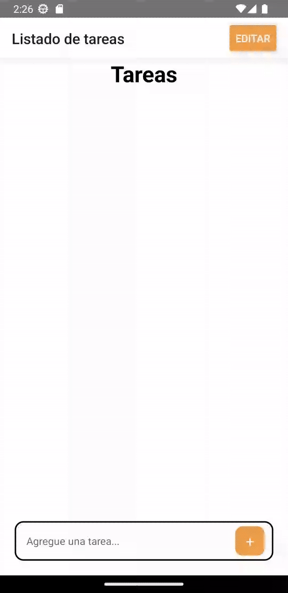
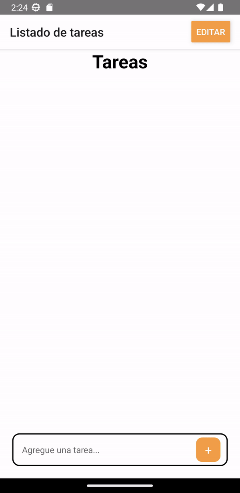

# Desarrollo de aplicaciones móviles - Practica React Native
Universidad Tecnologica Nacional - Facultad Regional Santa Fe

To-do list app hecha con React-Native, utilizando Async Storage, Context y Navigation.

    
    

<h2>Integrantes:</h2>
<ul>
    <li>Espertino, Clarisa</li>
    <li>Forestello, Antonella</li>
    <li>Peiretti, Tomás</li>
</ul>
